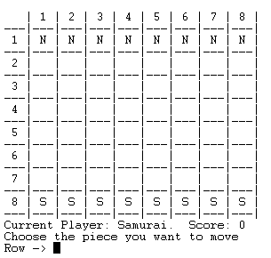
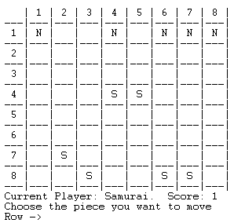
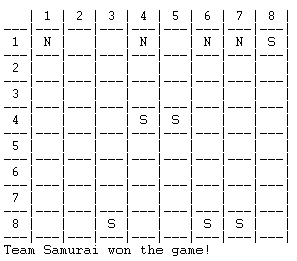

# PFL Project 2

This project consists of implementing a board game for 2 players named *Shi* in Prolog.

### Group Identification (Shi_2)
| Name                      | Student nº  | Contribution |
|---------------------------|-------------|--------------|
| João Gil Marinho Mesquita | up201906682 | 50%          |
| Rui Filipe Teixeira Alves | up201905853 | 50%          |

---
## Setup and Execution

1. Download source files
2. Load `main.pl` file in SICStus GUI
3. Type `play.` in the GUI

---
## Game Description
*Shi* is a 8x8 board game that can be played by 2 players that take the role of **Ninja** and **Samurai**. Initially, there are 8 pieces per side, set up on the players' first row. The game is always started by the **Samurai** Army.

The main goal of this game is to reduce the enemy army to 4 pieces. To do this, all the pieces move like a *Chess Queen*, that is, an unlimited number of cells in all directions and attack the enemy with **jump attacks**. These attacks can only be made by jumping over a single friendly piece along the path of attack. Any number of unoccupied spaces, including none, may exist on that path. Furthermore, the piece being jumped, must always be an ally and never an enemy. For this reason, attacks can only target the first enemy in the path of attack.


---
## Game Logic
### Internal Representation of the Game State

In order to represent the Game State, we decided to have a 2D Array, storing each element of the Board, and a Number representing the current Player, having GameState = Board-Player. Since our game has 2 types of pieces, Samurais and Ninjas, we decided to represent Samurais has `samurai`, Ninjas has `ninja` and empty spaces has `empty`.

Initially, the Board starts with 8 Ninjas and 8 Samurais, where Ninjas are displayed in the first row and Samurais in the last row. The other rows start empty. The user has the possibility to choose what army he wishes to command. This is then setup in the predicate `initial_state(P1Army, Board-Player)` that will use the `manageArmies(Army, StartingPlayer)` method to dinamically assert rules into the database. More specifically, assign each player number to its army. 

To represent a `Move`, we use the following structure: `startRow/startCol/StepsX/StepsY/Direction`.


```prolog
initialBoard([
[ninja,ninja,ninja,ninja,ninja,ninja,ninja,ninja],
[empty,empty,empty,empty,empty,empty,empty,empty],
[empty,empty,empty,empty,empty,empty,empty,empty],
[empty,empty,empty,empty,empty,empty,empty,empty],
[empty,empty,empty,empty,empty,empty,empty,empty],
[empty,empty,empty,empty,empty,empty,empty,empty],
[empty,empty,empty,empty,empty,empty,empty,empty],
[samurai,samurai,samurai,samurai,samurai,samurai,samurai,samurai]
]).

middleBoard([
[ninja,ninja,empty,ninja,ninja,empty,empty,ninja],
[empty,empty,empty,samurai,empty,empty,empty,empty],
[empty,empty,empty,empty,empty,empty,empty,empty],
[empty,empty,empty,empty,ninja,ninja,empty,empty],
[samurai,empty,samurai,empty,empty,empty,empty,empty],
[empty,empty,empty,empty,empty,empty,empty,empty],
[empty,empty,empty,empty,empty,empty,empty,empty],
[empty,empty,samurai,empty,empty,samurai,samurai,samurai]
]).

endBoard([
[ninja,ninja,empty,ninja,empty,empty,empty,empty],
[empty,empty,empty,empty,empty,empty,empty,empty],
[empty,empty,empty,empty,empty,empty,empty,empty],
[empty,empty,empty,empty,ninja,ninja,empty,empty],
[samurai,empty,empty,empty,empty,empty,empty,empty],
[empty,empty,empty,empty,empty,empty,empty,empty],
[empty,empty,empty,empty,empty,empty,empty,empty],
[empty,empty,ninja,ninja,empty,samurai,samurai,samurai]
]).
```

---

### Visualization of the Game State

Initially, we provide to the User a Main Menu asking him to choose the type of game he wants to play. Then, if the game chosen was Player against an AI, we provide a second menu asking him to choose the Army which he wants to command, that can either be `Ninjas` or `Samurai`. Those Armies are represented as, respectively, `N` and `S` in the board. Finally, we ask him the level of the AI, which can be `easy` or `hard`. This way, we can show to the User the current GameState, using the following predicates:

- `symbol`, that converts the internal representation to how we will show to the User the elements of the game

- `print_text`, that writes a text with a padding in the screen

- `printBoardHeader` - displays the board header
- `printBoardEmpty` - displays an Empty row of the board

- `printBoardRow` - displays a row by iterating through it and writting each element in the screen

- `printBoard` - displays the board by calling the `printBoardRow` predicate for each row of the board

- `display_game` that calls `printBoardHeader`, `printBoardEmpty` and `printBoard` to display the current GameState.

Additionally, we decided to show to the User the current GameState, by showing the current player and its respective game evaluation, by using the predicate `printCurrentPlayer(Board, Player)`. This predicate will get that game evaluation by using `value(Board, Player, Value)` predicate, which is explained in the section **Game State Evaluation**.

---

### Turn Execution

- Since our Board is a 2D array, we decided that the plays done by the Users would be represented by two numbers representing the row and column of the piece he wants to move. 

- In order to get the next move, we use the predicate `choose_move(Board-Player, Player, Move)`, which can have 3 outcomes: 
    - if Player is human, then we read and validate his move
    - if Player is AI, we choose a random move or the best move, depending on the chosen AI Level

- In our game, the pieces can move like a *Chess Queen*, so we use the predicate `parseMove(StartRow/StartCol, EndRow/EndCol, Direction, StepsX, StepsY)` in order to get the Direction (vertical, horizontal and diagonal), StepsX, StepsY and check if the move is correct according to the game rules

- After that, we check if that move is valid in our GameState, by using `isValidMove(Board-Player, CurrMove)` predicate, that evaluates the board by iterating through it and checking if the move is a `Jump Attack` or if it doesn't have any ally or enemy piece between the current position and the final position. To do so, we first create a list with the trajectory of the move. Having this list, we then filter it using the `clearPrefix(X, Steps, Direction, Row, Symbol)` predicate, which will set the starting position has the head of the list. Finally, we check if the movement is valid taking into account the number of ally pieces between the initial position and the final position, using `validateTrajectory(Steps, [Symbol | RemainingRow], Symbol, AllyCount)`

- After having the desired move validated, we use the predicate `move(GameState, Move, UpdatedGameState)` to apply it, which calls the respective predicate based on the direction of *Move*. Consequently, that predicate will replace the old position by an empty space and the new position with the piece he moved, by using the predicate `placeSymbol(X, Y, [Row | RemainingBoard], ResultingBoard, Acc, Symbol)`

---

### End Game

The end of the game is reached when a player is reduced to 4 pieces, declaring that the other player won. In order to check that, we use the predicate `isEndGame(Board)` which will iterate through the Board and count the pieces of each player, by using the predicate `countBoardPieces(Board, NinjaCount, SamuraiCount)`.

---

### Valid Plays

To obtain the list of valid moves of a player, we use the predicate `valid_moves(Board-Player, Moves)`. For this, we iterate each board cell and, whenever we find a player's piece we execute the following steps:

1. Calculate the number of cells to the right, left, top and bottom of that piece.
2. For each move direction `(left, right, top, bottom, top left, bottom left, top right, bottom right)` we call the `findMovesRange(GameState, X, Y, StepsX, StepsY, direction, RowMoves, Acc)` method that will verify every possible move in that direction, starting in the position `(X+StepsX, Y+StepsY)` and decrementing Steps by 1 at each iteration until they reach 0.
3. In the case of diagonal movement, there's an additional step required before (2), since `StepsX` must be equal to `StepsY`. For every diagonal direction, we need to calculate what is the minimum number of cells available to move and restrain both `StepsX` and `StepsY` to that absolute value, without changing its direction.
4. Every solution found will be stored in the accumulator and appended to the list containing all moves.

After this iterative process, `Moves` will contain all the possible moves of a given player according to the current game state.

---

### Game's State Evaluation

To evaluate the current Game State, we use the predicate `value(Board, Player, Value)`. This predicate, by using `countBoardPieces(Board, NinjaCount, SamuraiCount)`, will get the number of pieces of each player and then calculate the difference between them from the perspective of the current player. This way, a higher score is better for the current player.

---

### Computers's Move

To execute a computer's move, we use the predicate `choose_move(Board-Player, _GameType-Level, Move)`. First, this method displays the current player and generates the list of valid moves. After that, it chooses a move from the list. Hence, there are 2 ways to choose the move depending on the AI level:

- Easy level --> Select a random Move from the list of Moves.
- Hard level --> According to the *Shi* rules, the best possible outcome of a player's turn is capturing an enemies' piece. Since we have a predicate to evaluate the state of the game from the view of a specific player (`value`), we just need to calculate the value before the move and choose a move that increments that player score by 1, since it's the maximum increment a single round might give. 

---
## Conclusion

The main goal of this project was to apply the subjects taught in *Programação Funcional e em Lógica*, more specifically the Logical Programming methodology using Prolog. 

Since we are used to different paradigms, this project challenged us to re-think on the problems we had and how to solve them. After a few weeks, this issue was already solved.

Although we have tried to provide a friendly user interface, we felt that there were some limitations, such as the lack of colors.

A next step to improve the game would be to include a natural language parsing to get user inputs. For example, specifying a move from (0, 2) to (0, 4) could be done by writing `move right 2`. 

In conclusion, the main goal of the project was achieved and by doing it we improved our knowledge in *Logical Programming* and *Prolog*.

---
## Bibliography

- https://sicstus.sics.se/sicstus/docs/4.2.3/html/sicstus/The-Prolog-Library.html

- https://boardgamegeek.com/boardgame/319861/shi

## Annex

### Initial State Board


### Intermediary State Board


### Final State Board
